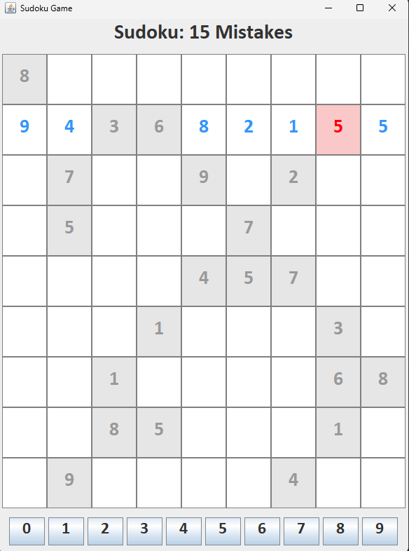

# Sudoku

This is a desktop-based **Sudoku Game** built with **Java Swing** and **Java 25**. This project provides a simple GUI, allowing players to interact with a preloaded puzzle, select tiles, and attempt to solve the board.


## Requirements
Java JDK must be installed on local machine. Project is compatible with Java 8 or higher.

You will also need a somewhat decent PC to run this.

Compile the files using an IDE like IntelliJ or using the JDK included tools. 

## Windows

Inside Windows CLI, cd to the src file and type:

```bash
   javac -d out .\src\*.java
   ```

Then, go to "out" then "production" folder and type

```bash
   jar --create --file SudokuApp.jar --main-class Sudoku *.class
   ```

to get a .jar file and be able to use the project.

## Linux and Mac users
Cd into the project, then type:

```bash
   javac -d out src/*.java
   ```

Then

```bash
   jar cfe Sudoku.jar Sudoku -C out .
   ```
to get the Jar file and use the application. to run, just simply:

```bash
   java -jar Sudoku.jar
   ```

